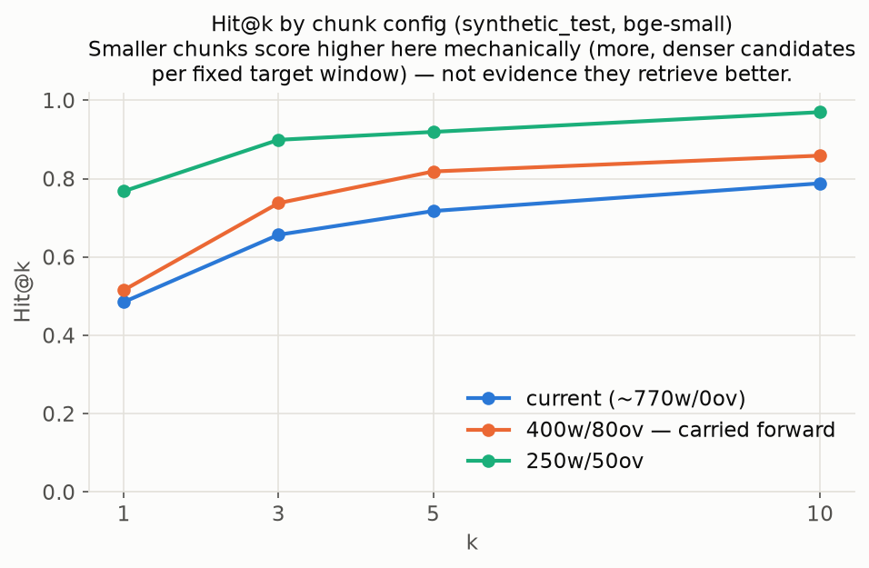
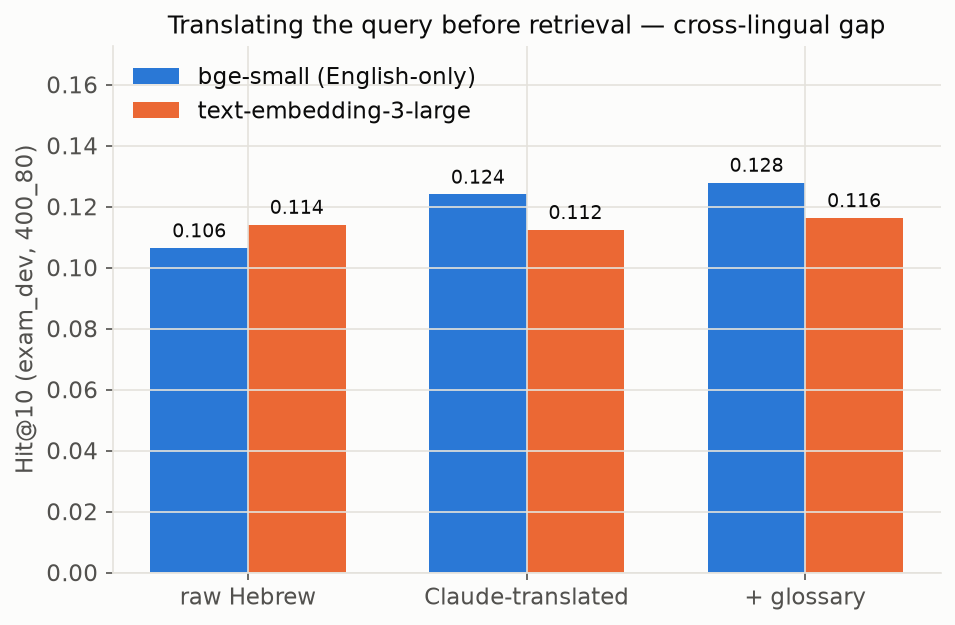
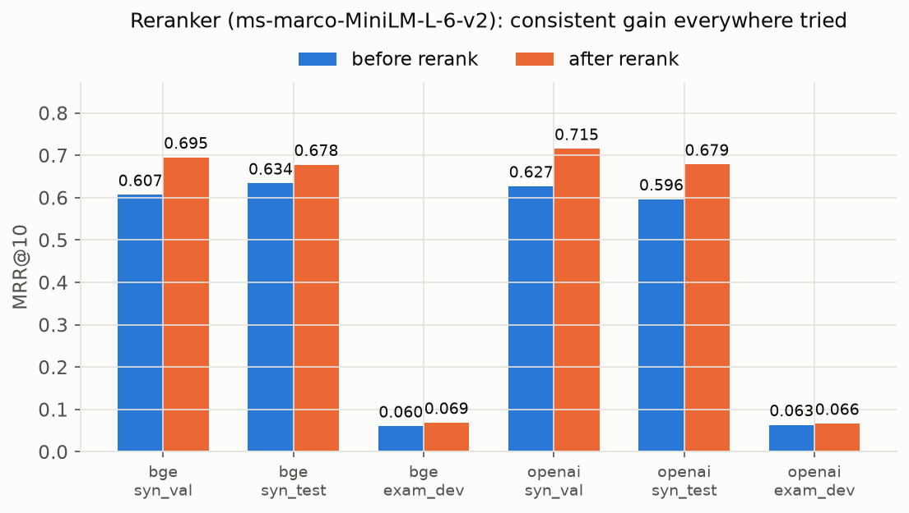
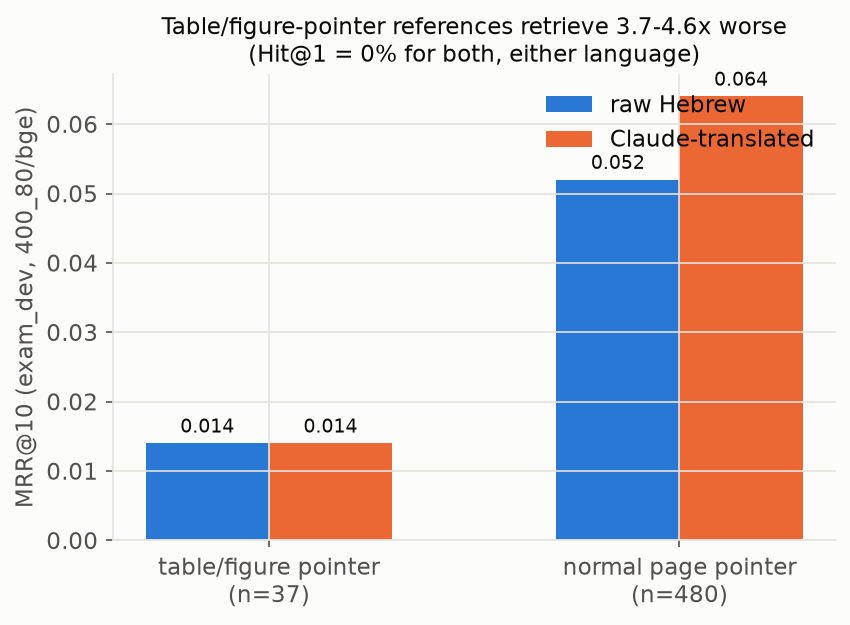
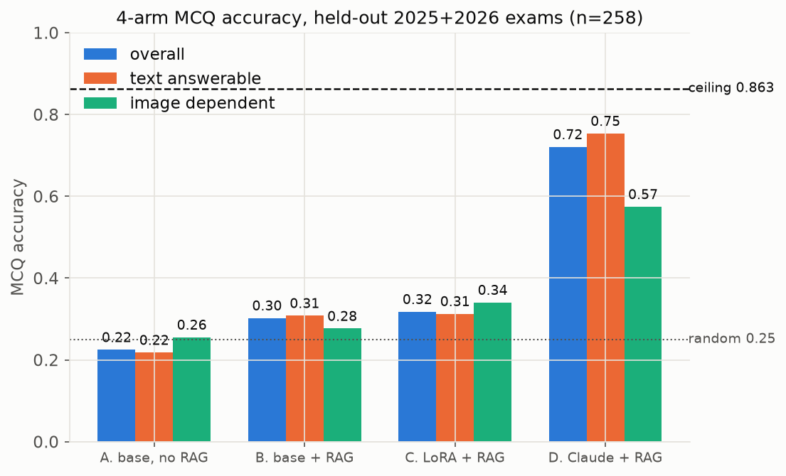
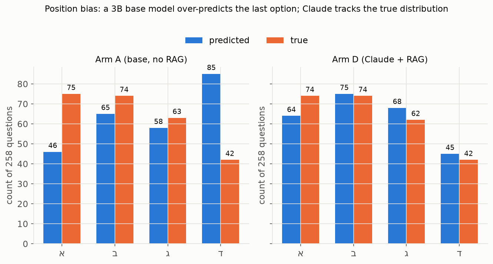

# DermaForce
### RAG + QLoRA for Hebrew Dermatology Board-Exam QA
Applied Language Models — Group Project B (solo)

---

## The gap this project closes

A working RAG chatbot (Qdrant + OpenAI embeds + Claude) already existed as a
product. Missing for the course:

- **Experiments & results** — no metrics, no ablations
- **Analysis** — no failure analysis, no hallucination study
- **QLoRA fine-tuning** — hard requirement, entirely absent
- Evaluating a model on **its own generated questions** (circular)

**Fix:** 949 real Israeli board-exam questions (2021–2026), each with an
independent human-expert page/chapter citation into the exact corpus indexed.

---

## System design

```
Hebrew MCQ → glyph fix → translate to EN → retrieve (EN corpus) → score 4 options
              │                                        │
              └── raw-Hebrew vs. translated query ──────┘  (cross-lingual experiment)

PRODUCT:      Qdrant + OpenAI embeds → Claude → answer → verifier badge → Next.js UI
MEASUREMENT:  chunks.jsonl → FAISS index variants → retrieval metrics
                            → Claude-distilled QA → QLoRA Qwen2.5-3B → 4-arm eval
```

---

## Two datasets

| | Bolognia + synthetic QA | Israeli board exams |
|---|---|---|
| Size | 6,115 chunks → 1,219 QA items | 949/950 MCQs, 7 sittings |
| Ground truth | Claude-generated (circular) | **Human expert citation** |
| Split | 1,000/120/99, by chunk | Develop 2021–24 / **hold out 2025+26** |
| Role | Training data | The honest test set |

Parsing required per-file format detection: 2 numbering conventions, 2 broken-glyph
bugs, 3 reference formats, a 2023 cross-version alignment table, crop-box-intersected
image detection.

---

## Chunking fix



Old chunker: whole pages accumulated past a word target → 766w median, **zero**
effective overlap. Fixed: exact word-stream window. `400w/80ov` carried forward — not
the top scorer, the honest one (see next slide).

---

## Two eval sets pull chunk size in opposite directions

- **Synthetic gold** (page-overlap to one exact source chunk) → favors *more, smaller*
  chunks: denser candidates mechanically inflate Hit@k.
- **Exam gold** (±2-page tolerance around a candidate's own span) → favors *wider*
  chunks: more absolute page coverage per chunk, independent of content quality.

`400_80` sits between both artifacts, never the worst on either — the config the
chunking fix actually produces, not cherry-picked after the fact.

---

## Cross-lingual retrieval — the headline result



Raw Hebrew vs. Claude-translated query, exam-dev, `400_80`. `bge-small` (English-only)
gains **+19% relative Hit@10** from translating first; `text-embedding-3-large` (real
cross-lingual capability) stays flat.

---

## Why translation helps — two worked examples

**2024_09 Q57** (atopic dermatitis epidemiology):
raw-Hebrew top-1 → *Fungal Diseases* (wrong) · translated top-1 → *Atopic Dermatitis* (right)

**2024_09 Q79** (which nevus finding needs excision):
raw-Hebrew top-1 → *Erythema Multiforme/SJS/TEN* (wrong) · translated top-1 →
*Benign Melanocytic Neoplasms* (right)

An English-only embedder has no lexical grip on untranslated Hebrew — translating
restores literal term overlap it can use directly.

---

## Reranker: a clean, low-risk win



`ms-marco-MiniLM-L-6-v2`, top-20 → top-10. Improves MRR@10 in **every one of 6**
query-set × embedder combinations tested.

---

## A distinct, worse retrieval-failure class



References pointing at a specific table/figure (37/517 dev questions) retrieve
**3.7–4.6× worse**, Hit@1 = 0% in both languages — the direct cost of dropping figure
captions at extraction time. A *retriever*-side ceiling, distinct from the
*generator*-side image-dependent ceiling ahead.

---

## QLoRA fine-tune

`Qwen2.5-3B-Instruct`, 4-bit NF4, LoRA rank ∈ {8, 16, 32}, trained on Colab.

- Target: citation-grounded answers, Claude-distilled, in the product's own
  `[Chapter, p.N]` format
- Training examples where the actual retriever misses the gold chunk → relabeled to
  explicit abstention (never taught to state facts absent from shown context)
- Val loss plateaus flat (~0.29–0.31) for all 3 ranks from step ~50; train loss drops
  fastest for r=32 — **overfitting scales with rank, measured not assumed**
- r=16 carried forward: least overfit rank with real capacity

---

## 4-arm MCQ accuracy (n=258 held-out 2025+2026)



Ceiling = 86.3% (47/258 questions are image-dependent, unanswerable from text alone).
Claude+RAG captures **83.5% of everything a text-only system could get right** — not
"72% accurate."

---

## Position bias: model artifact vs. exam convention



Exam's own gold distribution is skewed (option א correct 75×, ד only 42× — a real
exam-writing convention). Arm A shows genuine *model* bias on top of that
(over-predicts ד 2× its true rate); Claude tracks the true distribution almost
exactly.

---

## Two artifacts caught before being reported as findings

- **Multi-hop references "score better"** (Hit@1 0.087 vs 0.028) — only because they
  resolve to a **1.7× larger gold-chunk set** on average. Not better multi-hop
  reasoning; an artifact.
- **97.3% of exam-dev questions overlap the synthetic set's sampled content** —
  stratified sampling already reaches everywhere. Rules out "coverage gap" as the
  explanation for the synthetic-vs-exam accuracy gap.

Discipline: every number here was checked against a second explanation before being
written up as a finding.

---

## Verifier agent — live demo moment

`backend/verifier.py`: extracts each claim + citation, checks it against the
retrieved chunks, returns a groundedness score → UI badge (`frontend/`).

- Real, correctly-cited claim → `groundedness_score = 1.0`
- Fabricated citation (`[Chapter: 12 Psoriasis, p.999]`) attached to an unrelated
  claim → `citation_valid = false, supported = false`

Distinguishes real grounding from real hallucination — not just JSON shape.

**Out-of-corpus abstention**: 21/24 genuinely out-of-scope questions correctly
declined (0.875 rate); the 3 that didn't abstain outright still scored
groundedness 0.986 — nuanced partial answers, not confident hallucinations.

---

## Limitations

- Translation is a demonstrated error source (though rarely fails outright)
- Page map is an interpolation (122/160 chapters anchored, rest inferred; ±1–2pp validated)
- Arm D (letter-generation) not directly comparable to A/B/C (log-likelihood)
- Two metric artifacts mean every Hit@k/MRR number here is "given this gold-set
  geometry," not absolute
- Both corpora copyrighted, not redistributed
- Image-dependent questions: a measured, hard ceiling for any text-only system

---

## Conclusion & future work

A real product, measured honestly against **independent human ground truth**, not
questions it generated itself — full retrieval ablation, 4-arm comparison, QLoRA
fine-tune, and a verifier that demonstrably catches hallucination.

**Next levers, by expected payoff:**
1. Re-include figure captions as retrievable text (raises the ceiling, doesn't just measure it)
2. Deeper training-time retrieval budget for the LoRA arm (closer to product's top-8)
3. Larger multi-hop / table-figure eval slices, now cleanly isolated as failure classes

---

# Thank you
Questions?
